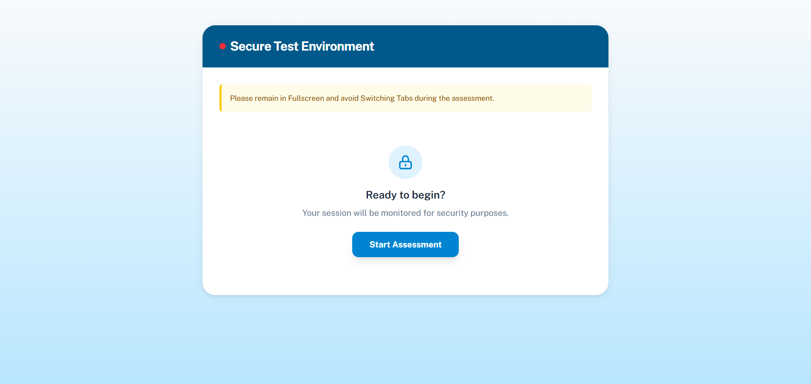
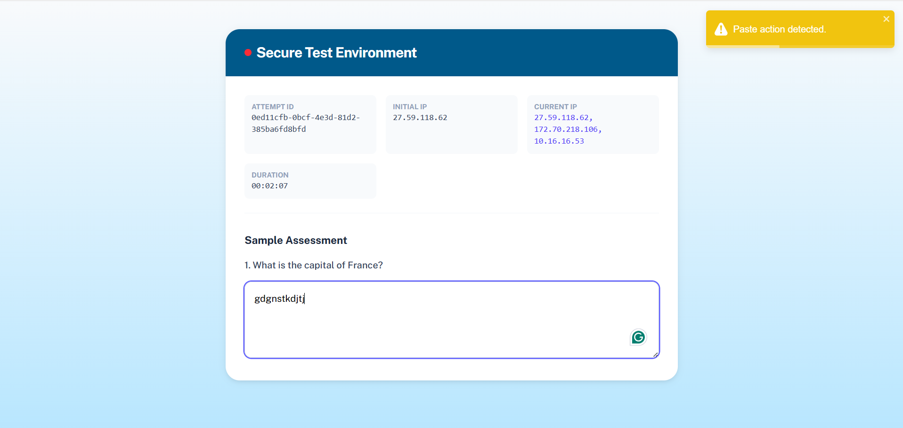

# 🔐 Secure Test Environment (STE)

> A robust, non-intrusive monitoring system for online assessments.

[](https://reactjs.org/)
[](https://nodejs.org/)
[](https://tailwindcss.com/)

This project simulates a production-style proctoring environment that:

- Captures initial IP address
- Monitors IP changes
- Detects browser violations
- Batches monitoring logs
- Handles offline scenarios gracefully
- Maintains non-blocking, neutral user experience

---

## 🌐 Live Deployment

Frontend (Vercel):  
👉 **[https://secure-test-env-tawny.vercel.app/](https://secure-test-env-tawny.vercel.app/)**

Backend (Render):  
👉 **[https://secure-test-env.onrender.com/](https://secure-test-env.onrender.com/)**

> ⚠️ Note: Backend runs on Render free tier. First request may take 20–40 seconds due to cold start.

## 📸 Screenshots

### 🖥️ Assessment Dashboard



---

### ⚠️ Monitoring & Violation Toast



---

## 🧠 Core Features

### 1️⃣ Secure Session Initialization
- Generates unique `attemptId`
- Captures initial client IP
- Automatically enters fullscreen mode
- Session duration timer (HH:MM:SS)

---

### 2️⃣ IP Monitoring
- Checks client IP every 10 seconds
- Extracts first forwarded client IP (proxy-safe)
- Normalizes IPv6 → IPv4 format
- Logs IP changes as violations
- Stable comparison logic for reverse proxy environments (Render/Vercel)

---

### 3️⃣ Browser Activity Monitoring

Detects:

- Tab switching
- Window blur
- Fullscreen exit
- Copy attempts
- Paste attempts

All violations:
- Logged in event queue
- Displayed via non-blocking toast notifications
- Neutral language (non-accusatory tone)
- Assessment continues without interruption

---

### 4️⃣ Batched Event Logging
- Events are batched every 5 seconds
- Reduces API load
- Improves performance
- Clears queue after successful submission

---

### 5️⃣ Offline Resilience
- Events stored in `localStorage`
- Automatically retried if network fails
- Prevents event loss during temporary disconnections

---

## 🏗️ Architecture Overview
User Browser
↓
Frontend (React + Vite - Vercel)
↓ API Calls
Backend (Express - Render)
↓
In-Memory Attempt Store


### Flow Summary:

1. User clicks "Start Assessment"
2. Backend generates `attemptId` and captures initial IP
3. Frontend enters fullscreen mode
4. Monitoring begins:
   - IP checks every 10 seconds
   - Browser event listeners activated
5. Events batched and sent every 5 seconds
6. Backend stores logs per attempt

---

## 📂 Project Structure
```
secure-test-environment/
│
├── backend/
│ ├── server.js
│ ├── package.json
│
├── frontend/
│ ├── src/
│ │ ├── components/
│ │ ├── hooks/
│ │ └── ...
│ ├── package.json
│
├── screenshots/
│   ├── img-1.png
│   ├── img-2.png
└── README.md
```
---

## 🔧 Local Setup Instructions

### 1️⃣ Clone Repository

git clone: [https://github.com/abhishek-mishra-frontend-dev/secure-test-env](https://github.com/abhishek-mishra-frontend-dev/secure-test-env)
```bash
cd secure-test-environment
```
---

### 2️⃣ Start Backend
```bash
cd backend
npm install
npm start
```
Backend runs at:
http://localhost:5000

---

### 3️⃣ Start Frontend
```bash
cd frontend
npm install
npm run dev
```

Create a `.env` file inside `frontend`:

VITE_API_BASE_URL=http://localhost:5000


---

## ☁️ Deployment Configuration

### Backend (Render)

- Root Directory: `backend`
- Build Command:
npm install

- Start Command:
npm start

- Uses:
const PORT = process.env.PORT || 5000;


---

### Frontend (Vercel)

- Root Directory: `frontend`
- Environment Variable:
VITE_API_BASE_URL=[https://secure-test-env.onrender.com/](https://secure-test-env.onrender.com/)

- Redeploy after adding environment variable

---

## 🔐 Production Considerations

- IP extraction uses first forwarded client IP for proxy-safe comparison.
- IPv6-mapped IPv4 addresses are normalized.
- Monitoring does not block assessment.
- All warnings use neutral, non-accusatory language.
- Network interruptions handled gracefully.
- In-memory storage used for demonstration purposes.
- Reverse proxy environments (Render/Vercel) supported.

---

## 🚀 Tech Stack

### Frontend
- React (Vite)
- React Hooks
- React Toastify
- Axios
- Tailwind CSS

### Backend
- Node.js
- Express
- UUID
- CORS

---

## 📌 Notes

- In-memory storage is used (no database).
- Designed for architectural and monitoring demonstration.
- Production-ready structure with deployment-safe IP handling.
- Render free tier may introduce initial cold-start delay.

---

## 👨‍💻 Author

**Abhishek Mishra**
